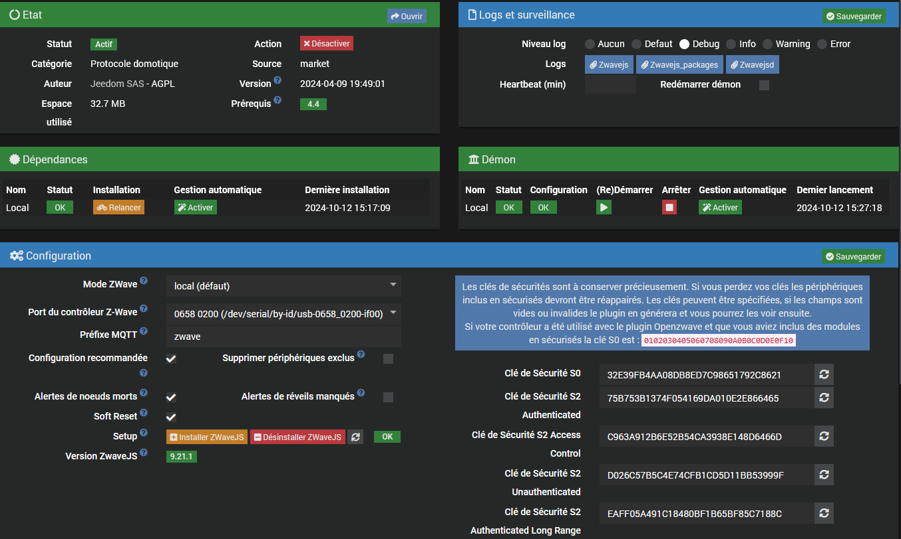

# Plugin Zwave-Js

Version améliorée du plugin officiel [zwavejs](https://github.com/jeedom/plugin-zwavejs)

## Mode local
Attention l'installation des dépendances n'installe plus le deamon local, il faut utiliser le bouton `ìnstaller ZwaveJS`. 
 La version `zwave-js-ui` qui sera installée et le préfixe MQTT par défaut se trouvent dans le fichier `core/config/zwavejs.config.ini`
 L'avancement de l'installation se trouve dans la log `zwavejs_packages`. Le voyant doit être vert et à OK et la version doit s'afficher en dessous une fois l'installation terminée.

Pour plus d'infos voir la [doc](https://doc.jeedom.com/fr_FR/plugins/automation%20protocol/zwavejs) du plugin ZWaveJS

## Mode remote docker (non managé)

### Installation de l'image
Installer l'image `zwave-js-ui` sur le docker distant:

	$ sudo docker pull zwavejs/zwave-js-ui

Copier et extraire l'archive générée `data/store/remote/docker_config.tar.gz` dans un répertoire local sur la machine distante ex:

	$ sudo mkdir -p /root/store/zwavejs
	$ cd /root/store/zwavejs
	$ sudo tar xvfz /tmp/docker_config.tar.gz

Vous devez obtenir l'arborescence suivante:

	/root/store/zwavejs/config.json
	/root/store/zwavejs/config/

### Démarrage et arrêt du container

Copier et utiliser le script `resources/zwavejs` sur la machine distante pour gérer le container:

	$ sudo zwavejs 
	usage: zwavejs {start|stop|restart|status}

Si vous utilisez un répertoire local différent de `/root/store/zwavejs` modifiez le dans le script
 Idem pour le device, par exemple: `/dev/ttyACM0`

### Vérification du container

Connectez-vous sur `http://remote-ip:8091`

* Login: admin
* Password: zwave

Au bout de quelques secondes le driver doit passer à `Connected` (icône rond vert) et le statut à `Scan completed` 

### Paramètrage du plugin:
Page de configuration du plugin:

* IP du container distant
* Port d'administration du container (défaut 8091)
* Préfixe MQTT (défaut zwave)
* Communication container `ZWaveJS UI` et bouton `Tester`: vert si le container est démarré et disponible
* Version ZWaveJS UI: version de l'image

Vérifiez la communication en cliquant sur le bouton `Tester` 
 Le voyant `communication` doit passer au vert:

 Note: La version se mettra à jour après démarrage du deamon

### Démarrage du deamon
 Vous pouvez maintenant démarrer votre deamon Jeedom puis vérifier que les infos remontent:

